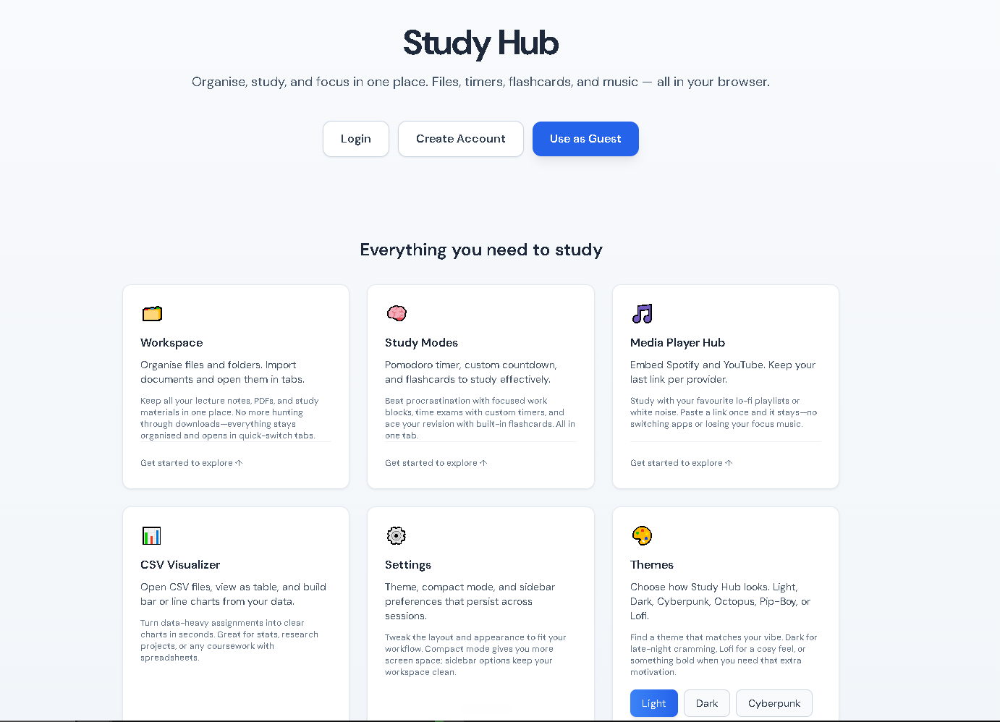
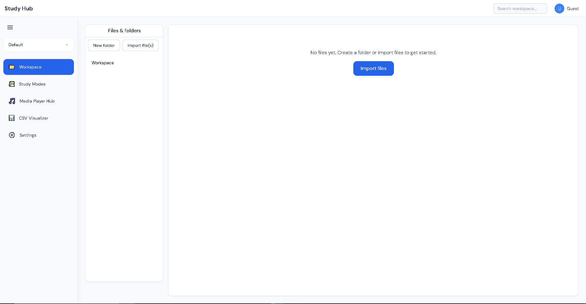
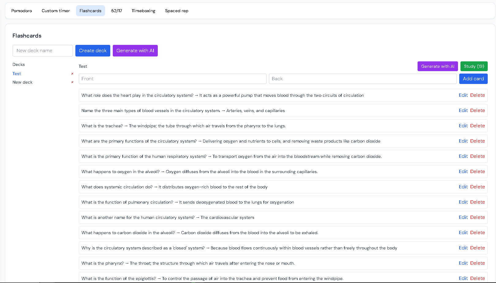
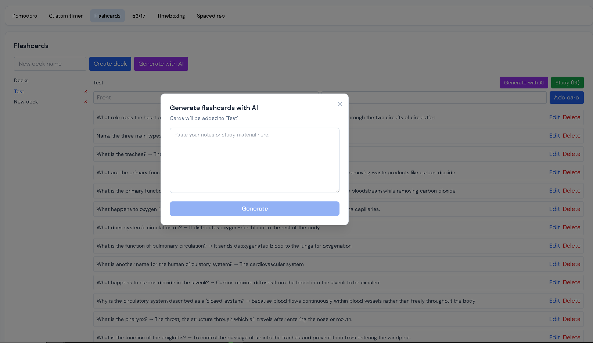
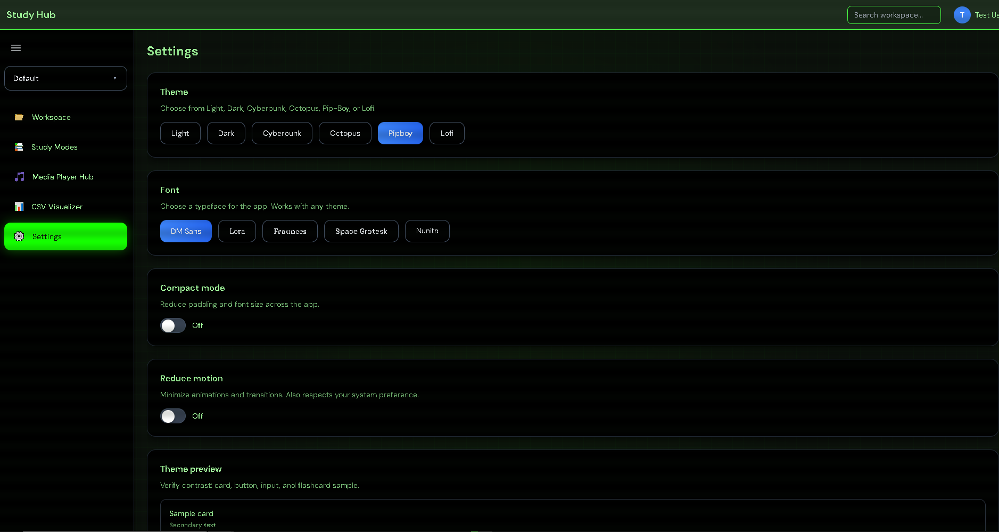

# Study Hub

> Organise, study, and focus in one place. Files, timers, flashcards, and music — all in your browser.

**Live demo:** [study-hub-aston-hack11.vercel.app](https://study-hub-aston-hack11.vercel.app)

Originally built at AstonHack 11 (24-hour hackathon at Aston University). Since the hackathon, the project has been significantly extended with a full backend, cloud sync, AI-powered flashcard generation, a test suite, and PWA support.

---

## Screenshots











---

## Features

**Workspace**
- File and folder organiser with drag-and-drop support
- Open PDFs, Word documents, images, and CSV files in tabs
- Persistent across sessions via IndexedDB

**Study Modes**
- Pomodoro timer with configurable work and break intervals
- Custom countdown timer
- 52/17 focus technique timer
- Timeboxing with custom block sequences
- Spaced repetition session planner
- Flashcard decks with study mode and shuffle

**AI Flashcard Generation**
- Paste any study notes or text
- Claude Haiku generates 5-15 flashcards instantly
- Preview and select which cards to keep before saving
- Rate limited to 5 generations per day per user
- Requires a logged-in account

**Media Player Hub**
- Embed Spotify playlists and YouTube videos
- Persistent links per provider across sessions

**CSV Visualiser**
- Upload CSV files and view as a table
- Generate bar or line charts from any columns

**Themes**
- Light, Dark, Cyberpunk, Octopus, Pip-Boy, Lofi
- Font selection: DM Sans, Lora, Fraunces, Space Grotesk, Nunito
- Compact mode and reduce motion options

**Auth and Cloud Sync**
- Register and log in with email and password
- JWT-based authentication
- Flashcard decks and notes sync to the cloud
- Guest mode available with local-only storage

**PWA Support**
- Installable on desktop and mobile
- Service worker with offline caching via Workbox
- App manifest with custom icons

---

## Tech Stack

**Frontend**
- React 18 with TypeScript
- Vite for bundling
- Tailwind CSS for styling
- React Router v6
- IndexedDB via idb for local persistence
- Vite PWA plugin with Workbox

**Backend**
- Spring Boot 3.5 with Java 21
- Spring Security with JWT authentication (JJWT 0.12.6)
- Spring Data JPA
- PostgreSQL (Neon, free tier, London region)
- RestClient for Anthropic API integration

**AI**
- Anthropic Claude Haiku via REST API
- Prompt engineering for structured JSON flashcard output
- Server-side rate limiting (5 requests per user per day)

**Infrastructure**
- Frontend deployed on Vercel (auto-deploys from GitHub)
- Backend deployed on Fly.io
- Database hosted on Neon Postgres

**Testing**
- Vitest with jsdom environment
- React Testing Library
- 34 tests across API layer, store functions, and UI components
- ~30% line coverage

---

## Architecture

```
┌─────────────────────────────────────────────┐
│                  Browser                     │
│                                             │
│   React + TypeScript (Vite)                 │
│   ┌──────────┐  ┌──────────┐  ┌─────────┐  │
│   │Workspace │  │  Study   │  │  Media  │  │
│   │ (IndexDB)│  │  Modes   │  │  Hub    │  │
│   └──────────┘  └──────────┘  └─────────┘  │
│                                             │
│   AuthContext (JWT in memory)               │
│   Service Worker (Workbox, offline cache)   │
└────────────────────┬────────────────────────┘
                     │ HTTPS + Bearer token
                     ▼
┌─────────────────────────────────────────────┐
│         Spring Boot 3.5 (Fly.io)            │
│                                             │
│   /api/auth  →  AuthController              │
│   /api/sync  →  SyncController              │
│   /api/ai    →  AiController                │
│                    │                        │
│   JwtAuthFilter (Spring Security)           │
│   BCrypt password hashing                   │
│   Rate limiter (5 AI req/day/user)          │
└──────────┬──────────────────────┬───────────┘
           │                      │
           ▼                      ▼
┌──────────────────┐   ┌──────────────────────┐
│  Neon PostgreSQL │   │  Anthropic API       │
│  (London region) │   │  Claude Haiku        │
│                  │   │  Flashcard generation│
│  Users           │   └──────────────────────┘
│  Decks           │
│  Cards           │
│  Notes           │
└──────────────────┘
```

---

## Running Locally

**Prerequisites:** Node 18+, Java 21, Maven 3.9+, PostgreSQL

**Frontend**

```bash
git clone https://github.com/WJ-42/StudyHub-AstonHack11
cd StudyHub-AstonHack11
npm install
cp .env.example .env
# Set VITE_API_URL=https://studyhub-backend-wj.fly.dev in .env
npm run dev
```

**Backend**

```bash
git clone https://github.com/WJ-42/studyhub-backend
cd studyhub-backend
# Set environment variables: DATABASE_URL, JWT_SECRET, ANTHROPIC_API_KEY
mvn spring-boot:run
```

**Run tests**

```bash
npm test
npm run test:coverage
```

---

## What I Built

This project was originally created at AstonHack 11 with one teammate. The division of work was:

**Hackathon (original build)**
- My teammate created the initial Spring Boot backend skeleton (entity classes, basic project structure)
- I built the entire frontend: React app architecture, all UI components, IndexedDB persistence layer, workspace file system, study modes (Pomodoro, timers, flashcards), media player, CSV visualiser, theming system, and responsive layout

**Post-hackathon upgrades (solo)**
- Rotated a leaked YouTube API key and fixed git history
- Migrated deployment from Netlify to Vercel, fixed base path config
- Built out the full backend from the skeleton: Spring Security, JWT auth, BCrypt hashing, all REST endpoints, CORS config, JPA entities and repositories
- Deployed backend to Fly.io with Neon Postgres as the database
- Wired up the frontend auth flow: AuthContext, JWT token management, login/register modal, cloud sync
- Built the AI flashcard generation feature end to end: Anthropic API integration in the backend, rate limiting, frontend modal with card preview and selection
- Set up Vitest + React Testing Library with 34 tests covering the API layer, auth, and UI components
- Added PWA support with Vite PWA plugin, Workbox service worker, and installable app manifest
- Rewrote this README

---

## Roadmap

- [ ] Email verification on registration
- [ ] Flashcard spaced repetition algorithm (SM-2)
- [ ] Collaborative workspaces
- [ ] Mobile-optimised layout improvements
- [ ] Export flashcard decks as CSV or PDF
